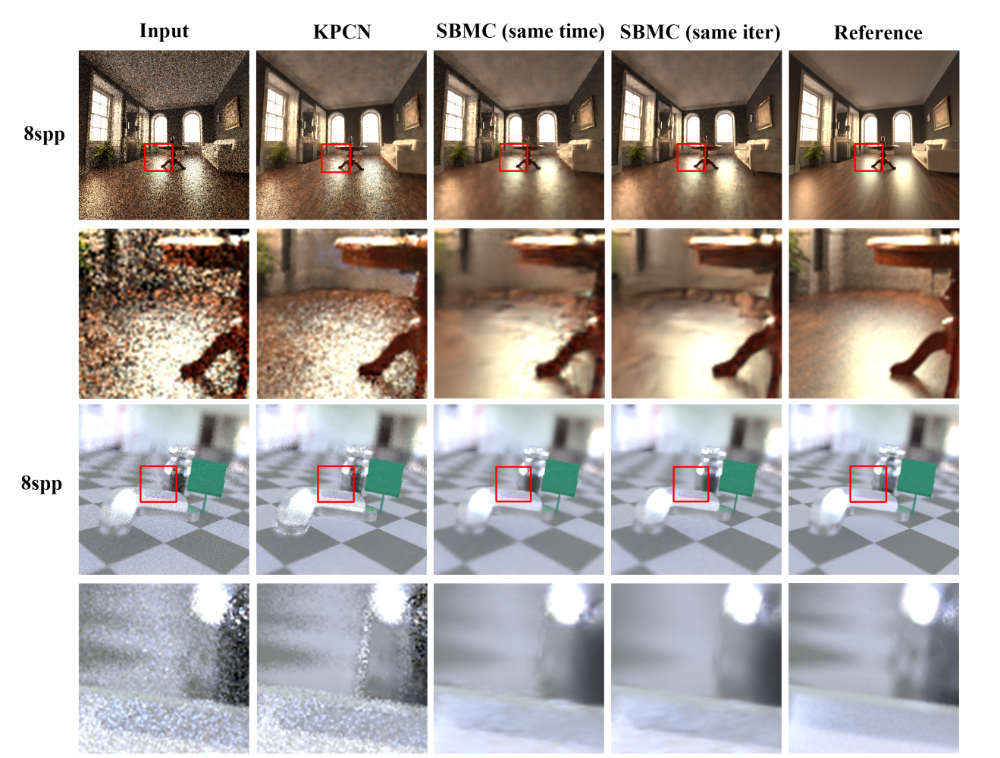

# Monte Carlo Denoising with Deep Learning



This repository implements a Monte Carlo Denoiser with deep learning methods [SBMC](http://groups.csail.mit.edu/graphics/rendernet/) and [KPCN](https://la.disneyresearch.com/wp-content/uploads/Kernel-Predicting-Convolutional-Networks-for-Denoising-Monte-Carlo-Renderings-Paper33.pdf).

You can download our project report here for reference: https://drive.google.com/file/d/1K2dC10D3HYg97vzv7sbogrlPzKb0pNpz/view?usp=sharing


## Installation and dependencies (Linux only)

You can use **pip** to install the Python dependencies.

```shell
$ pip install -r requirements.txt
```

The splatting kernel operator of SBMC is implemented in *Halide*. We have compiled the operator in Python3.9 for you in this repository. (See **models/halide_ops.cpython-39-x86_64-linux-gnu.so**)

If you are not able to run the code with this compiled operator and have to recompile it by yourself, please follow the following steps:

1. Build [LLVM-14.0](https://github.com/llvm/llvm-project/tree/release/14.x)

   ```shell
   $ git clone --depth 1 --branch release/14.x https://github.com/llvm/llvm-project.git
   
   $ cmake -DCMAKE_BUILD_TYPE=Release \
           -DLLVM_ENABLE_PROJECTS="clang;lld;clang-tools-extra" \
           -DLLVM_TARGETS_TO_BUILD="X86;ARM;NVPTX;AArch64;Mips;Hexagon;WebAssembly" \
           -DLLVM_ENABLE_TERMINFO=OFF -DLLVM_ENABLE_ASSERTIONS=ON \
           -DLLVM_ENABLE_EH=ON -DLLVM_ENABLE_RTTI=ON -DLLVM_BUILD_32_BITS=OFF \
           -S llvm-project/llvm -B llvm-build
   $ cmake --build llvm-build
   $ cmake --install llvm-build --prefix llvm-install
   
   $ export LLVM_ROOT=$PWD/llvm-install
   $ export LLVM_CONFIG=$LLVM_ROOT/bin/llvm-config
   ```

2. Build [Halide-14.0](https://github.com/halide/Halide/tree/release/14.x)

   ```shell
   $ git clone --depth 1 --branch release/14.x https://github.com/halide/Halide.git
   $ cd Halide && make
   $ export HALIDE_DISTRIB_PATH=/home/saltfish/Halide/distrib
   ```

3. Build the operator

   ```shell
   $ cd halide_ops && make
   $ cp bin/lib/*halide_ops*.so* ../models/
   ```


## Dataset

If you want to use our scenes/dataset to train/test the model, we provide our testset for downloading (https://drive.google.com/drive/folders/1fslW9fauJjHGGL3aRWWIi9yl9OORo61V?usp=sharing)

If you want to create the dataset in our style on your own, please refer to **generate_data.py** and **generate_shapenet.py** and prepare your own dataset.

We use a modified *Mitsuba3* to render the scenes with extra features for SBMC, but the source code of modified *Mitsuba3* isn't contain in this repo. If you have any question, please open an issue for it.


## Train & Test

Train the model with different modes

```shell
python train.py --mode sbmc --video # Train SBMC (video dataset)
python train.py --mode sbmc # Train SBMC (single-image dataset)
python train.py --mode kpcn # Train KCPN
```

We provide pre-trained models for both KPCN and SBMC, please download it at https://drive.google.com/drive/folders/1zG0GclJ9TpPsRfEo7Q-18KwWRlRWs3tK?usp=sharing

Then you can test the model with the pre-trained model

```shell
python test.py --mode sbmc --video --checkpoint 1150 # --checkpoint Test SBMC (video dataset)
python test.py --mode sbmc --checkpoint 1150 # Test SBMC (single-image dataset)
python test.py --mode kpcn --checkpoint 1150 # Test KCPN
```


## Reference

An implementation of KPCN: https://github.com/Nidjo123/kpcn 

Official implementation of SBMC: https://github.com/adobe/sbmc
