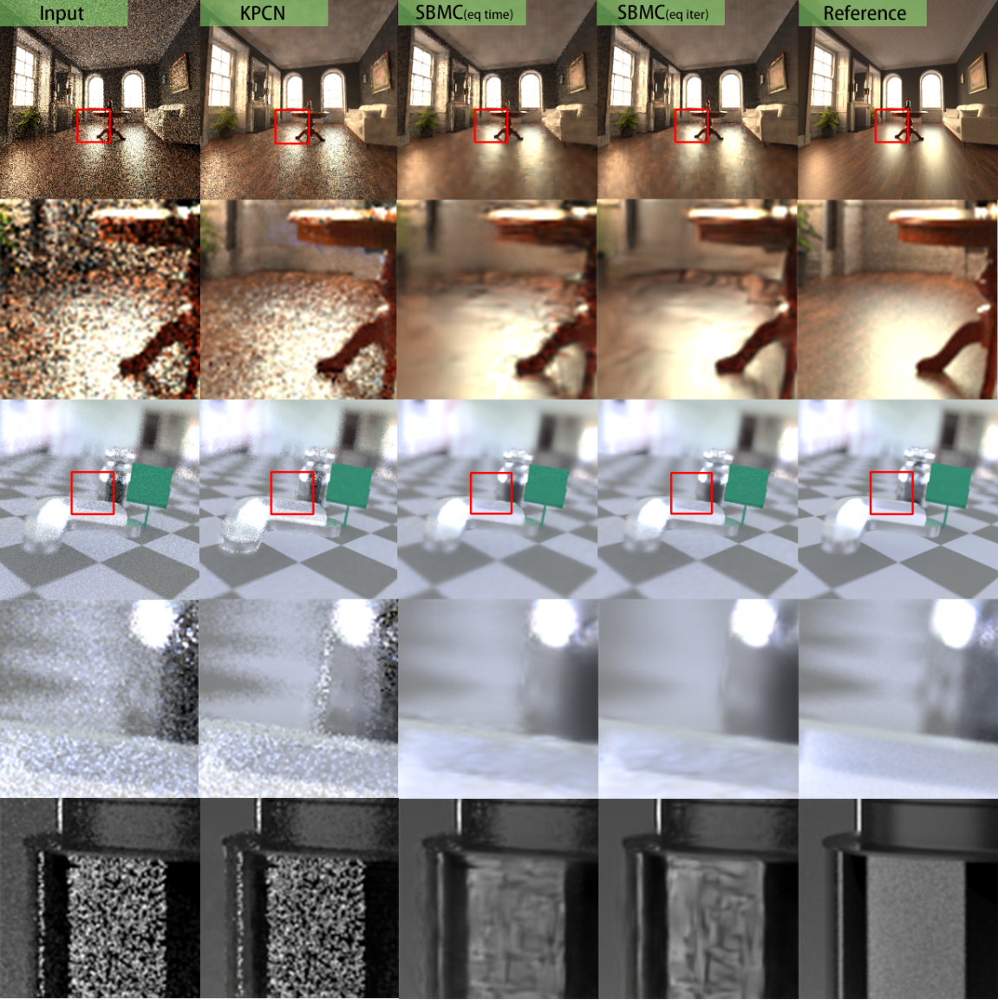

# Monte Carlo Denoising with Deep Learning

This repository implements a Monte Carlo Denoiser with deep learning methods [SBMC](http://groups.csail.mit.edu/graphics/rendernet/) and [KPCN](https://la.disneyresearch.com/wp-content/uploads/Kernel-Predicting-Convolutional-Networks-for-Denoising-Monte-Carlo-Renderings-Paper33.pdf).

The document of this repo is under construction, but you can download our project report here for a glimpse: https://drive.google.com/file/d/11zIyS7hK8X3jtl1n4aSkdVZOB4ffH-Gm/view?usp=share_link

